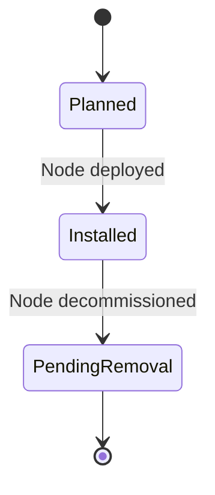

# Feature: Feature 72: Ethernet Transport Operational and Topology Roles (Issue #207)

**Parent Epic:** [Epic 26: Ethernet Transport Network Client Signals Common Types Model (Issue #210)](https://github.com/gintatkinson/cogctl-ux-09/blob/main/docs/epics/epic-26-eth-tran-types.md)

This feature introduces interface access roles, topology roles, priority settings, resilience and performance indicators, and lifecycle states (Planned, Installed, Pending-Removal) for Ethernet transport client interfaces.

## 1. Schema Definitions & Constraints
- Access roles: `access-role`, `root-primary`, `root-backup`, `leaf-access`.
- Lifecycle statuses: `lifecycle-status`, `planned`, `installed`, `pending-removal`.
- Topology and performance attributes: `topology-role`, `resilience`, `performance`, `priority`.

### Typedefs
- **lifecycle-status**: Enumeration representing lifecycle state.

### Choices
- None defined in this feature.

## 2. Logical System Integration & UI Capabilities
- Operators use these properties to set the active/backup roles for root nodes in point-to-multipoint topologies.
- Allows resource inventory tools to track provisioning stages (planned vs operational).

## 3. State Machine and Validation Flow

## 4. BDD Given-When-Then Acceptance Criteria
- **Scenario 1: Update interface lifecycle status**
  - **Given** a port is in `planned` status
  - **When** the hardware installation is completed
  - **Then** the operator updates the port's status to `installed`, activating it in routing paths.

## 5. Specification Context
> Defines topological roles and operational lifecycles for client interfaces.

## 6. Source References
YANG Schema: [ietf-eth-tran-types.yang](https://github.com/gintatkinson/cogctl-ux-09/blob/main/yang/ietf-eth-tran-types.yang)
Normative Specification: [draft-ietf-ccamp-client-signal-yang](https://datatracker.ietf.org/doc/draft-ietf-ccamp-client-signal-yang/)
