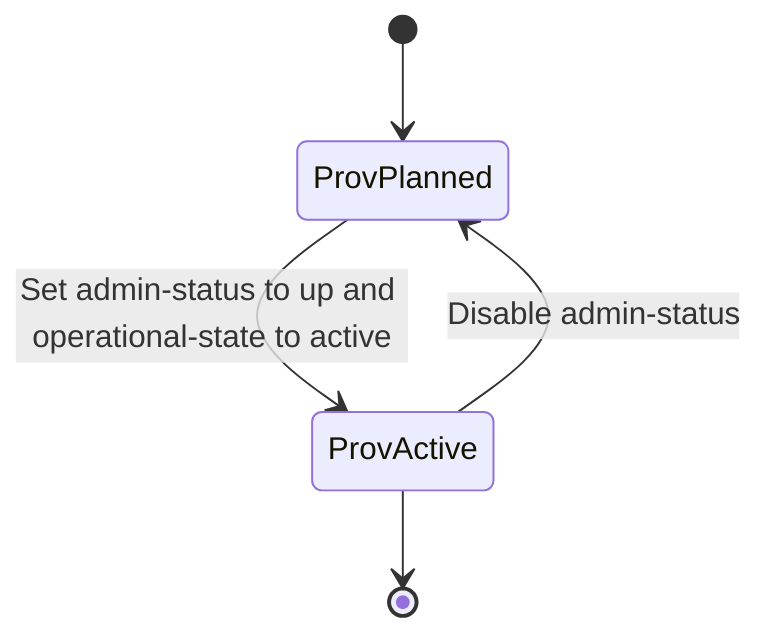

# Feature: Feature 73: Ethernet Transport Service Instances and Endpoints Core (Issue #211)

**Parent Epic:** [Epic 27: Ethernet Transport Network Client Services Model (Issue #218)](https://github.com/gintatkinson/cogctl-ux-09/blob/main/docs/epics/epic-27-eth-tran-service.md)

This feature introduces the service container, instance list, descriptive metadata, and administrative/operational state representation for Ethernet Client Services.

## 1. Schema Definitions & Constraints
- Service container: `etht-svc`
- Instance list: `etht-svc-instances` (key: `etht-svc-name`)
- Metadata: `etht-svc-title`, `etht-svc-descr`, `etht-svc-customer`, `etht-svc-type` (identityref to etht-types:service-type), `etht-svc-lifecycle` (identityref to etht-types:lifecycle-status).
- Operational records: `created-by`, `creation-time`, `last-updated-by`, `last-updated-time`, `owned-by`.
- Administrative and operational states: `admin-status` (te-types:te-admin-status), `oper-status` (te-types:te-oper-status), `provisioning-state` (identityref to te-types:provisioning-state-type), `operational-state` (identityref to te-types:operational-state-type).

### Typedefs
- None defined in this feature.

### Choices
- None defined in this feature.

## 2. Logical System Integration & UI Capabilities
- System operators configure Ethernet transport services (e.g. EVPL, E-LAN) by adding instances to the `etht-svc-instances` list.
- Administrative status controls the enabling and disabling of path calculations and circuit provisioning.

## 3. State Machine and Validation Flow

## 4. BDD Given-When-Then Acceptance Criteria
- **Scenario 1: Provision a new EVPL service instance**
  - **Given** an operator provisions a client service named "EVPL-NY-SF"
  - **When** the service type is set to `p2p-svc` and the admin-status is set to `up`
  - **Then** the instance is created, initialized with operational status, and marked with creation metadata.

## 5. Specification Context
> Defines global service attributes and administrative states for Ethernet transport networks.

## 6. Source References
YANG Schema: [ietf-eth-tran-service.yang](https://github.com/gintatkinson/cogctl-ux-09/blob/main/yang/ietf-eth-tran-service.yang)
Normative Specification: [draft-ietf-ccamp-client-signal-yang](https://datatracker.ietf.org/doc/draft-ietf-ccamp-client-signal-yang/)
