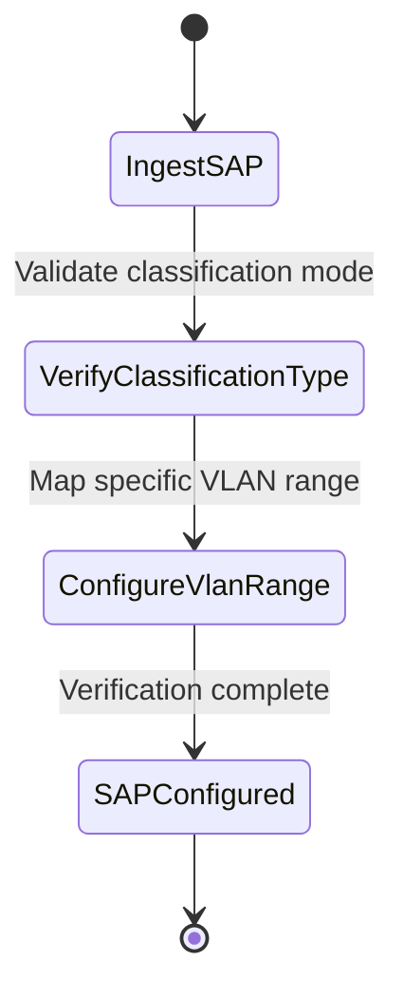

# Feature: Feature 74: Ethernet Transport Service Access Points and Classification (Issue #212)

**Parent Epic:** [Epic 27: Ethernet Transport Network Client Services Model (Issue #218)](https://github.com/gintatkinson/cogctl-ux-09/blob/main/docs/epics/epic-27-eth-tran-service.md)

This feature introduces Service Access Point (SAP) properties, network element references, traffic classification choices, and split-horizon group isolation parameters.

## 1. Schema Definitions & Constraints
- Access Point lists: `etht-svc-access-points` (key: `access-point-id`).
- SAP references: `access-node-id`, `access-node-uri`, `access-ltp-id`, `access-ltp-uri`.
- Access and topology roles: `access-role` (identityref to etht-types:access-role), `topology-role` (identityref to etht-types:topology-role).
- Traffic isolation: `split-horizon-group`, `src-split-horizon-group`, `dst-split-horizon-group`.
- Classification attributes: `service-classification-type` (identityref to etht-types:service-classification-type).
- Classification choices: `service-classification`, `individual-bundling-vlan`.
- Case choices: `port-classification`, `vlan-classification`, `individual-vlan`, `vlan-bundling`, `value`.
- VLAN references: `vlan-value` (etht-types:vlanid), `vlan-range` (etht-types:vid-range-type).

### Typedefs
- None defined in this feature.

### Choices
- **service-classification**: Choice between port-based classification and VLAN-based classification.
- **individual-bundling-vlan**: Choice between single VLAN classification and VLAN range bundling.

## 2. Logical System Integration & UI Capabilities
- Operators assign access points to client ports on physical nodes to bridge customer traffic into the transport network.
- Split-horizon groups ensure that traffic received from one SAP is not forwarded to another SAP in the same group.

## 3. State Machine and Validation Flow

## 4. BDD Given-When-Then Acceptance Criteria
- **Scenario 1: Configure VLAN-based classification on SAP**
  - **Given** a SAP is defined on interface `eth-0/1`
  - **When** the classification mode is set to VLAN-based with `vlan-range` set to `100..200`
  - **Then** only frames with VLAN tags between 100 and 200 are mapped to this service instance.

## 5. Specification Context
> Identifies Ethernet service access ports and traffic classification boundaries.

## 6. Source References
YANG Schema: [ietf-eth-tran-service.yang](https://github.com/gintatkinson/cogctl-ux-09/blob/main/yang/ietf-eth-tran-service.yang)
Normative Specification: [draft-ietf-ccamp-client-signal-yang](https://datatracker.ietf.org/doc/draft-ietf-ccamp-client-signal-yang/)
