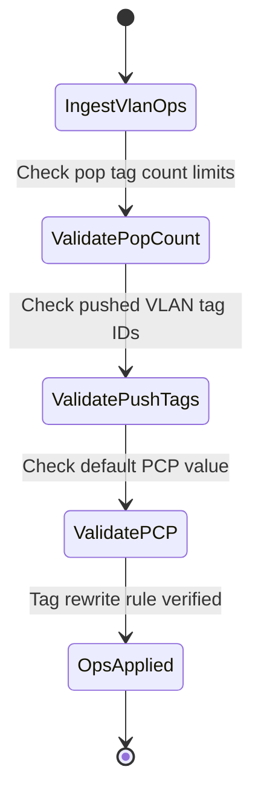

# Feature: Feature 75: Ethernet Transport Service Endpoints and Tag Operations (Issue #213)

**Parent Epic:** [Epic 27: Ethernet Transport Network Client Services Model (Issue #218)](https://github.com/gintatkinson/cogctl-ux-09/blob/main/docs/epics/epic-27-eth-tran-service.md)

This feature introduces Service Endpoint definitions and VLAN tag operations (e.g. tag stacking, pushing, popping, and default PCP values) for client interfaces.

## 1. Schema Definitions & Constraints
- Endpoint lists: `etht-svc-end-points` (key: `etht-svc-end-point-id`).
- Endpoint properties: `etht-svc-end-point-name`, `etht-svc-end-point-descr`, `encapsulation-type` (identityref to etht-types:encapsulation-type).
- VLAN rewriting operations: `vlan-operations` container, containing:
  - `pop-tags` (uint8) number of tags to pop.
  - `push-tags` (uint8) number of tags to push.
  - `outer-tag` and `second-tag` structures containing:
    - `tag-type` (identityref to etht-types:eth-vlan-tag-type).
    - `vlan-value` (etht-types:vlanid).
    - `default-pcp` (uint8 range 0..7) Priority Code Point.

### Typedefs
- None defined in this feature.

### Choices
- None defined in this feature.

## 2. Logical System Integration & UI Capabilities
- Enables provisioning QinQ tunnels by pushing an outer provider S-VLAN tag onto customer frames.
- Allows network elements to rewrite tag IDs to maintain VLAN consistency across the WAN.

## 3. State Machine and Validation Flow

## 4. BDD Given-When-Then Acceptance Criteria
- **Scenario 1: Configure outer VLAN tag push**
  - **Given** customer frames are classified under VLAN 100 on ingress
  - **When** the operator configures a VLAN operation to push 1 tag with an outer tag value of 1000 and default-pcp of 5
  - **Then** the outer S-VLAN tag is successfully provisioned and queued for packet encapsulation.

## 5. Specification Context
> Defines VLAN tag push/pop operations at service endpoints.

## 6. Source References
YANG Schema: [ietf-eth-tran-service.yang](https://github.com/gintatkinson/cogctl-ux-09/blob/main/yang/ietf-eth-tran-service.yang)
Normative Specification: [draft-ietf-ccamp-client-signal-yang](https://datatracker.ietf.org/doc/draft-ietf-ccamp-client-signal-yang/)
