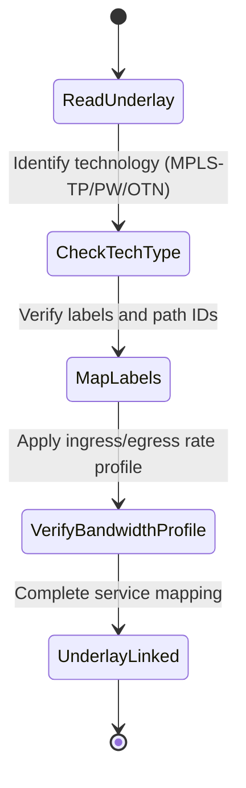

# Feature: Feature 76: Ethernet Transport Service Bandwidth Profiles and Underlays (Issue #214)

**Parent Epic:** [Epic 27: Ethernet Transport Network Client Services Model (Issue #218)](https://github.com/gintatkinson/cogctl-ux-09/blob/main/docs/epics/epic-27-eth-tran-service.md)

This feature introduces named bandwidth profiles (ingress, egress, symmetrical/asymmetrical operations) and mapping parameters to specify service underlay networks (MPLS-TP, PW paths, OTN tunnels).

## 1. Schema Definitions & Constraints
- Bandwidth profiles list: `named-bandwidth-profiles` (key: `bandwidth-profile-name`), containing rate limits.
- SAP Bandwidth constraints: `ingress-bandwidth-profile`, `egress-bandwidth-profile`, `ingress-egress-bandwidth-profile`.
- Bandwidth operation choices: `symmetrical-operation`, `asymmetrical-operation`, `direction`, `symmetrical`, `asymmetrical`, `style`, `named`, `ingress`, `egress`.
- Service underlay mapping: `underlay` container, containing choices for:
  - `technology`: choice between `mpls-tp`, `pw`, `native-ethernet`.
  - Tunnel Lists: `eth-tunnels`, `otn-tunnels`, `tp-tunnels`.
  - Pseudowire parameters: `pw-id` (uint32), `pw-name` (string), `pw-paths` list (key: `path-id`), containing `transmit-label` (uint32), `receive-label` (uint32), `switching-type`, `encoding`.

### Choices
- **direction**: Ingress/egress bandwidth choice.
- **symmetrical-operation**: Symmetrical bandwidth constraints.
- **asymmetrical-operation**: Asymmetrical bandwidth constraints.
- **style**: Symmetrical/asymmetrical style.
- **technology**: Underlay tunnel technology choice.

## 2. Logical System Integration & UI Capabilities
- Computes and maps client circuits over transport tunnels (OTN, PW, MPLS-TP) based on label mappings.
- Enforces ingress and egress CIR/EIR constraints globally or per direction.

## 3. State Machine and Validation Flow

## 4. BDD Given-When-Then Acceptance Criteria
- **Scenario 1: Map service to Pseudowire underlay**
  - **Given** an Ethernet service is configured on a client SAP
  - **When** the underlay technology is set to `pw` with `pw-id` 5005 and path `transmit-label` 16000
  - **Then** the service is successfully bound to the specified transport pseudowire.

## 5. Specification Context
> Maps Ethernet client services to underlying transport tunnels and label paths.

## 6. Source References
YANG Schema: [ietf-eth-tran-service.yang](https://github.com/gintatkinson/cogctl-ux-09/blob/main/yang/ietf-eth-tran-service.yang)
Normative Specification: [draft-ietf-ccamp-client-signal-yang](https://datatracker.ietf.org/doc/draft-ietf-ccamp-client-signal-yang/)
