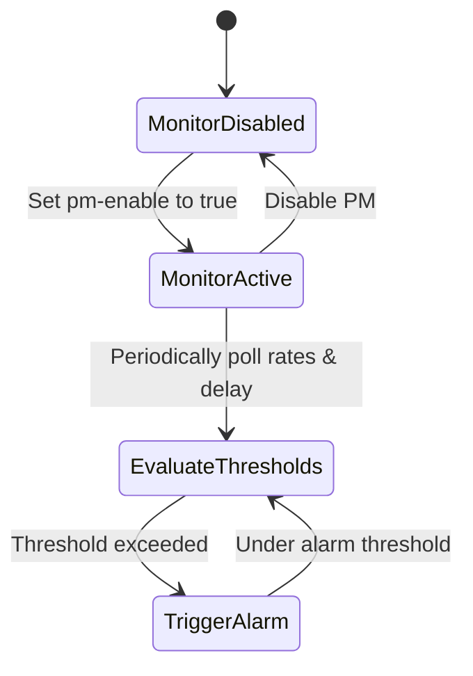

# Feature: Feature 77: Ethernet Transport Service Performance Monitoring and Alerts (Issue #215)

**Parent Epic:** [Epic 27: Ethernet Transport Network Client Services Model (Issue #218)](https://github.com/gintatkinson/cogctl-ux-09/blob/main/docs/epics/epic-27-eth-tran-service.md)

This feature introduces performance monitoring configurations, alarm/latency thresholds, TX/RX rate parameters, and state/error indicators for Ethernet client services.

## 1. Schema Definitions & Constraints
- Performance settings: `pm-config` container, containing:
  - `pm-enable` (boolean).
  - `latency-threshold` (uint32) in microseconds.
  - `alarm-threshold` container, containing limits: `receiving-rate-too-high`, `receiving-rate-too-low`, `receiving-rate-high`, `receiving-rate-low`, `sending-rate-too-high`, `sending-rate-too-low`, `sending-rate-high`, `sending-rate-low`.
- Performance status: `pm-state` container, containing:
  - `state` (operational state).
  - `latency` (uint32) current latency.
  - `resilience` (resilience statistics).
  - `performance` (performance records).
- Diagnostics: `error-info` container, containing `error-code` (uint32), `error-description` (string), `error-timestamp` (yang:date-and-time).
- Global structures: `globals`, `name`, `user-label`, `frame-base`.

### Choices
- None defined in this feature.

## 2. Logical System Integration & UI Capabilities
- System agents monitor packet loss, delay, and throughput on client services.
- Triggers notifications to NMS dashboard when packet rates or latency exceed thresholds.

## 3. State Machine and Validation Flow

## 4. BDD Given-When-Then Acceptance Criteria
- **Scenario 1: Monitor latency threshold**
  - **Given** performance monitoring is enabled on an EVPL service
  - **When** the current measured delay exceeds `latency-threshold` of 50000 microseconds
  - **Then** the system logs an error state in `error-info` and alerts the network operator.

## 5. Specification Context
> Defines telemetry parameters and thresholds for client services.

## 6. Source References
YANG Schema: [ietf-eth-tran-service.yang](https://github.com/gintatkinson/cogctl-ux-09/blob/main/yang/ietf-eth-tran-service.yang)
Normative Specification: [draft-ietf-ccamp-client-signal-yang](https://datatracker.ietf.org/doc/draft-ietf-ccamp-client-signal-yang/)
