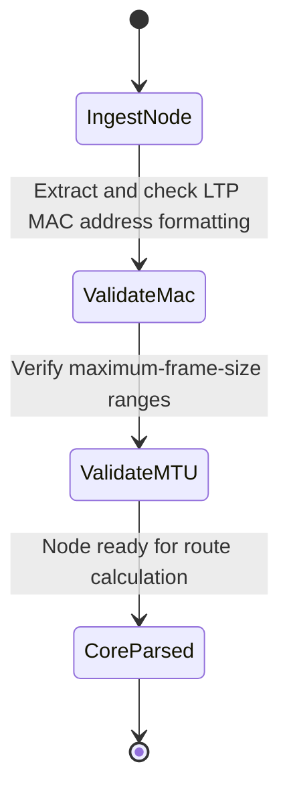

# Feature: Feature 78: Ethernet TE Topology Core (Issue #219)

**Parent Epic:** [Epic 28: Ethernet Client Traffic Engineering Topology Model (Issue #225)](https://github.com/gintatkinson/cogctl-ux-09/blob/main/docs/epics/epic-28-eth-te-topology.md)

This feature introduces the core extensions augmenting TE nodes, links, and termination points with Ethernet-specific attributes (MAC addresses, maximum frame sizes).

## 1. Schema Definitions & Constraints
- Topology presence grouping: `eth-tran-topology`
- Node augmentations: `eth-node`
- Link and TP augmentations: `eth-link-tp` and `eth-svc`
- Parameters:
  - `ltp-mac-address` (ietf-yang-types:mac-address) Link Termination Point MAC address.
  - `maximum-frame-size` (uint32) MTU size.
  - Case: `eth` used for choosing Ethernet properties.

### Typedefs
- None defined in this feature.

### Choices
- None defined in this feature.

## 2. Logical System Integration & UI Capabilities
- Enhances topology databases by storing MAC addresses and MTUs for Ethernet ports.
- Prevents path routing over links with mismatched MTUs (e.g. standard 1500 vs jumbo 9000).

## 3. State Machine and Validation Flow

## 4. BDD Given-When-Then Acceptance Criteria
- **Scenario 1: Read Ethernet LTP MAC address and MTU**
  - **Given** an Ethernet Link Termination Point is discovered by the topology driver
  - **When** the attributes are parsed
  - **Then** the `ltp-mac-address` is stored as `00:11:22:33:44:55` and the `maximum-frame-size` is verified as 9000.

## 5. Specification Context
> Defines Ethernet-specific metadata on nodes, links, and ports within the TE topology structure.

## 6. Source References
YANG Schema: [ietf-eth-te-topology.yang](https://github.com/gintatkinson/cogctl-ux-09/blob/main/yang/ietf-eth-te-topology.yang)
Normative Specification: [draft-ietf-ccamp-eth-client-te-topo-yang](https://datatracker.ietf.org/doc/draft-ietf-ccamp-eth-client-te-topo-yang/)
