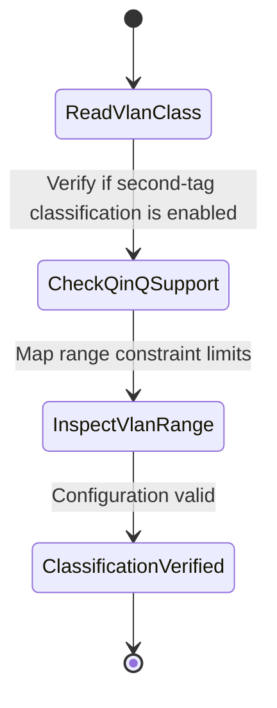

# Feature: Feature 79: Ethernet TE Topology VLAN Classification (Issue #220)

**Parent Epic:** [Epic 28: Ethernet Client Traffic Engineering Topology Model (Issue #225)](https://github.com/gintatkinson/cogctl-ux-09/blob/main/docs/epics/epic-28-eth-te-topology.md)

This feature introduces capabilities to advertise supported VLAN classification styles, bundling, ranges, and port default VLANs in the TE topology.

## 1. Schema Definitions & Constraints
- Classification capability container: `supported-classification`
- Capability leaves:
  - `port-classification` (boolean) Port-based classification support.
  - `vlan-classification` (boolean) VLAN-based classification support.
  - `vlan-tag-classification` (boolean) outer VLAN tag classification support.
  - `second-tag-classification` (boolean) second tag (QinQ) classification support.
  - `vlan-bundling` (boolean) VLAN bundling support.
- VLAN identification parameters:
  - `port-vlan-id` (etht-types:vlanid) Default port VLAN ID.
  - `vlan-range` (etht-types:vid-range-type) Range of allowed VLAN values on the LTP.

### Typedefs
- None defined in this feature.

### Choices
- None defined in this feature.

## 2. Logical System Integration & UI Capabilities
- Path computation engines scan links to identify if the interface supports QinQ classification (`second-tag-classification`).
- Limits VLAN provisioning on ports based on the advertised `vlan-range` constraints.

## 3. State Machine and Validation Flow

## 4. BDD Given-When-Then Acceptance Criteria
- **Scenario 1: Verify QinQ classification support**
  - **Given** a port is queried for classification capabilities
  - **When** the `second-tag-classification` capability is true
  - **Then** the path computation engine marks the port as compatible for multi-tag service termination.

## 5. Specification Context
> Advertises VLAN matching rules and default port IDs across Ethernet interfaces.

## 6. Source References
YANG Schema: [ietf-eth-te-topology.yang](https://github.com/gintatkinson/cogctl-ux-09/blob/main/yang/ietf-eth-te-topology.yang)
Normative Specification: [draft-ietf-ccamp-eth-client-te-topo-yang](https://datatracker.ietf.org/doc/draft-ietf-ccamp-eth-client-te-topo-yang/)
