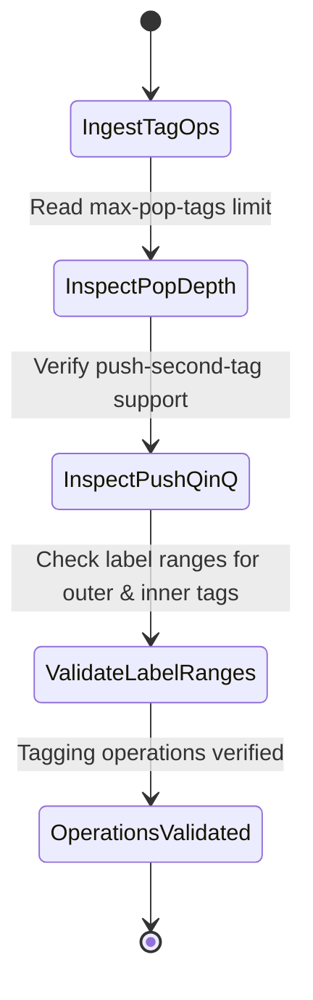

# Feature: Feature 80: Ethernet TE Topology VLAN Tag Operations (Issue #221)

**Parent Epic:** [Epic 28: Ethernet Client Traffic Engineering Topology Model (Issue #225)](https://github.com/gintatkinson/cogctl-ux-09/blob/main/docs/epics/epic-28-eth-te-topology.md)

This feature introduces tag operations (VLAN pushing, popping, stacking capabilities) and Ethernet label ranges advertised by termination points.

## 1. Schema Definitions & Constraints
- Capability container: `supported-vlan-operations`
- Parameters:
  - `transparent-vlan-operations` (boolean) Support transparent tag passing.
  - `vlan-push` (container) containing:
    - `vlan-push-operation` (boolean) Push support.
    - `push-second-tag` (boolean) QinQ double-tag push support.
  - `vlan-pop` (container) containing:
    - `vlan-pop-operations` (boolean) Pop support.
    - `max-pop-tags` (uint8) Maximum tags popped (0..2).
- Tag type lists: `supported-tag-types` (key: `tag-type`).
- Label range container: `ethernet-label-range`, containing:
  - `outer-tag` (container) Outer tag constraints.
  - `second-tag` (container) Second tag constraints.

### Typedefs
- None defined in this feature.

### Choices
- None defined in this feature.

## 2. Logical System Integration & UI Capabilities
- Network operators query port hardware properties to determine if the port can perform VLAN tag push/pop operations.
- Verifies maximum pop depth (e.g. up to 2 tags) before calculating QinQ pathways.

## 3. State Machine and Validation Flow

## 4. BDD Given-When-Then Acceptance Criteria
- **Scenario 1: Read VLAN tag popping capability**
  - **Given** a port is queried for tagging operation capabilities
  - **When** the `max-pop-tags` limit is set to 2 and `vlan-pop-operations` is true
  - **Then** the network manager registers support for QinQ packet tag removal on ingress.

## 5. Specification Context
> Advertises tag popping, pushing, and range constraint boundaries.

## 6. Source References
YANG Schema: [ietf-eth-te-topology.yang](https://github.com/gintatkinson/cogctl-ux-09/blob/main/yang/ietf-eth-te-topology.yang)
Normative Specification: [draft-ietf-ccamp-eth-client-te-topo-yang](https://datatracker.ietf.org/doc/draft-ietf-ccamp-eth-client-te-topo-yang/)
