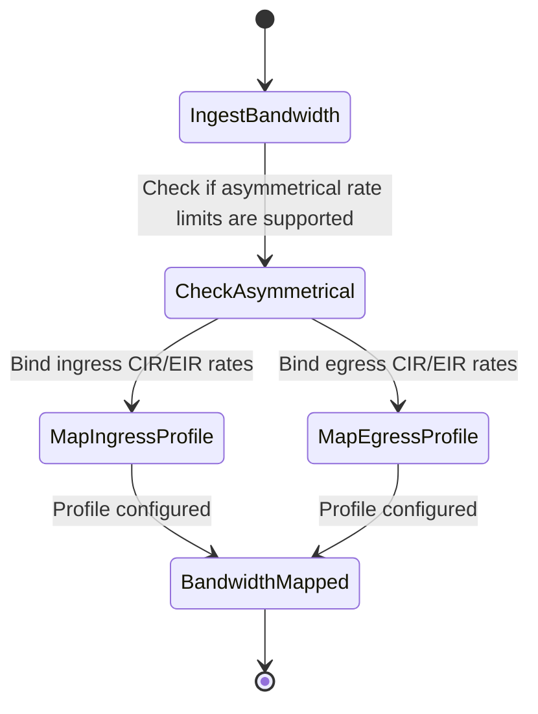

# Feature: Feature 81: Ethernet TE Topology Bandwidth Profiles (Issue #222)

**Parent Epic:** [Epic 28: Ethernet Client Traffic Engineering Topology Model (Issue #225)](https://github.com/gintatkinson/cogctl-ux-09/blob/main/docs/epics/epic-28-eth-te-topology.md)

This feature introduces interface bandwidth profile advertisements (ingress, egress, symmetrical/asymmetrical support) within the TE topology.

## 1. Schema Definitions & Constraints
- Bandwidth container: `ingress-egress-bandwidth-profile`
- Bandwidth leaf:
  - `asymmetrical-operations` (boolean) Asymmetrical rate limit support flag.
- Bandwidth structures: `ingress-bandwidth-profile`, `egress-bandwidth-profile`.
- Bandwidth operation choices: `direction`, `symmetrical`, `asymmetrical`.

### Typedefs
- None defined in this feature.

### Choices
- **direction**: Bandwidth direction choice (ingress vs egress).

## 2. Logical System Integration & UI Capabilities
- Advertises rate limits (CIR, PIR, CBS, PBS) on interfaces for traffic engineering.
- Path calculation algorithms evaluate links to ensure ingress/egress bandwidth capacity matches request criteria.

## 3. State Machine and Validation Flow

## 4. BDD Given-When-Then Acceptance Criteria
- **Scenario 1: Read asymmetrical rate limit capabilities**
  - **Given** a TE link is queried for bandwidth capabilities
  - **When** the `asymmetrical-operations` flag is true
  - **Then** the link is registered as supporting independent ingress and egress rate limiting profiles.

## 5. Specification Context
> Advertises interface bandwidth profiles and symmetrical/asymmetrical operation flags.

## 6. Source References
YANG Schema: [ietf-eth-te-topology.yang](https://github.com/gintatkinson/cogctl-ux-09/blob/main/yang/ietf-eth-te-topology.yang)
Normative Specification: [draft-ietf-ccamp-eth-client-te-topo-yang](https://datatracker.ietf.org/doc/draft-ietf-ccamp-eth-client-te-topo-yang/)
