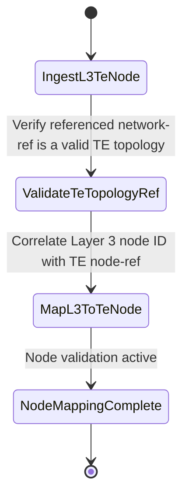

# Feature: Feature 82: Layer 3 TE Topology and Node Attributes (Issue #226)

**Parent Epic:** [Epic 29: Layer 3 TE Topologies Model (Issue #230)](https://github.com/gintatkinson/cogctl-ux-09/blob/main/docs/epics/epic-29-l3-te-topology.md)

This feature introduces Layer 3 TE Topology type definition and Node level mapping attributes.

## 1. Schema Definitions & Constraints
- Topology type presence: `l3-te`
- Topology attributes container: `l3-te-topology-attributes` (maps network to a base TE topology referenced via `network-ref`).
- Node attributes container: `l3-te-node-attributes` (maps Layer 3 node to a corresponding TE node reference).

### Constraints
- The referenced network must exist and be defined as a TE topology (`tet:te-topology`).

### Typedefs
- None defined in this feature.

### Choices
- None defined in this feature.

## 2. Logical System Integration & UI Capabilities
- Enables representation of OSPF-TE or IS-IS-TE network topologies inside a unified data model.
- Maps IP routing nodes directly to the underlying physical/logical Traffic Engineering nodes.

## 3. State Machine and Validation Flow

## 4. BDD Given-When-Then Acceptance Criteria
- **Scenario 1: Correlate Layer 3 Unicast Node to TE Node**
  - **Given** a Layer 3 node with OSPF-TE enabled is discovered
  - **When** the node attributes are processed
  - **Then** the `l3-te-node-attributes` container is populated with the corresponding `network-ref` and `node-ref` references.

## 5. Specification Context
> Defines Layer 3 TE topology presence and node attributes mapping containers.

## 6. Source References
YANG Schema: [ietf-l3-te-topology.yang](https://github.com/gintatkinson/cogctl-ux-09/blob/main/yang/ietf-l3-te-topology.yang)
Normative Specification: [draft-ietf-teas-yang-l3-te-topo-18](https://www.ietf.org/archive/id/draft-ietf-teas-yang-l3-te-topo-18.txt)
