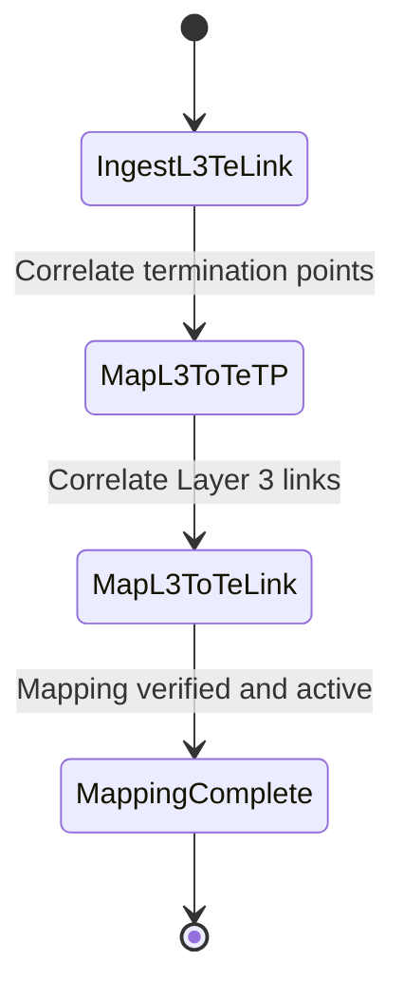

# Feature: Feature 83: Layer 3 TE Topology Links and Termination Points (Issue #227)

**Parent Epic:** [Epic 29: Layer 3 TE Topologies Model (Issue #230)](https://github.com/gintatkinson/cogctl-ux-09/blob/main/docs/epics/epic-29-l3-te-topology.md)

This feature introduces Layer 3 TE Link and Termination Point level correlation attributes.

## 1. Schema Definitions & Constraints
- Termination Point attributes container: `l3-te-tp-attributes` (maps L3 termination point/port to a corresponding TE termination point reference).
- Link attributes container: `l3-te-link-attributes` (maps L3 link to a corresponding TE link reference).

### Constraints
- The referenced network must exist and be defined as a TE topology (`tet:te-topology`).

### Typedefs
- None defined in this feature.

### Choices
- None defined in this feature.

## 2. Logical System Integration & UI Capabilities
- Maps IP routing interfaces and links directly to the underlying physical/logical TE links and ports.
- Allows network management tools to audit if IP-level links match operational TE-level states.

## 3. State Machine and Validation Flow

## 4. BDD Given-When-Then Acceptance Criteria
- **Scenario 1: Correlate Layer 3 Unicast Link to TE Link**
  - **Given** a Layer 3 unicast link mapped to a physical trunk is discovered
  - **When** the link attributes are processed
  - **Then** the `l3-te-link-attributes` container is populated with the corresponding `network-ref` and `link-ref` references.

## 5. Specification Context
> Defines Layer 3 TE link and termination point attributes mapping containers.

## 6. Source References
YANG Schema: [ietf-l3-te-topology.yang](https://github.com/gintatkinson/cogctl-ux-09/blob/main/yang/ietf-l3-te-topology.yang)
Normative Specification: [draft-ietf-teas-yang-l3-te-topo-18](https://www.ietf.org/archive/id/draft-ietf-teas-yang-l3-te-topo-18.txt)
